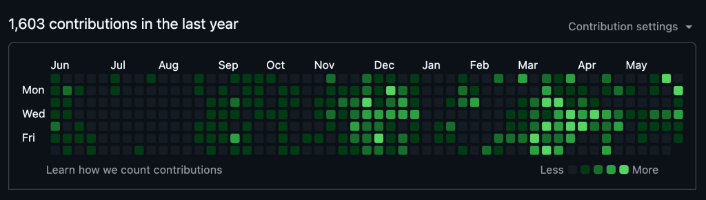

# Olá, eu sou o Randel Freitas! 👋
### Software Engineer & Full Stack Developer

  
  
  

---

## 📊 Atividade & Consistência no GitHub

  
   
  <strong>🔥 1.603 contribuições no último ano mantendo consistência e ritmo acelerado.</strong>

---

## 🔒 Por que meu GitHub público parece "vazio"?

Se você está visitando meu perfil e notou poucos repositórios públicos, a explicação é simples e profissional:

* 💼 **Projetos Comerciais e Corporativos (NDA):** A grande maioria dos softwares, APIs e ecossistemas que desenvolvo diariamente são de propriedade de empresas e clientes. Por estarem protegidos por **acordos de confidencialidade (NDA)**, eles ficam hospedados em organizações privadas.
* 🚀 **17 Projetos Ativos:** Atualmente, atuo de forma ativa na arquitetura, desenvolvimento, manutenção e evolução de **17 projetos distintos e simultâneos** de grande porte.
* ⚡ **Prática Diária:** Minha dedicação à engenharia de software é contínua e incansável, como comprovado pela intensidade do meu gráfico de contribuições acima.

---

## 🤝 Atenção, Recrutadores & Líderes Técnicos!

Não tire conclusões baseadas apenas no feed público! Tenho muito orgulho da qualidade técnica do que construo e adoraria compartilhar isso com você. 

Se você é recrutador, gestor de engenharia ou potencial parceiro de negócios, **entre em contato comigo**! Ficarei muito feliz em agendar uma conversa para:
- 💻 Fazer uma **demonstração ao vivo (Screen Share)** das arquiteturas e códigos dos meus 17 projetos ativos em homologação.
- 📐 Discutir boas práticas de design de sistemas, clean architecture, padrões de projeto e performance.
- 🛠️ Realizar sessões de live coding ou pareamento técnico para resolver desafios.

---

## 🛠️ Tecnologias & Ferramentas que Utilizo

Abaixo estão as principais tecnologias com as quais trabalho cotidianamente na construção desses 17 projetos:

### 🌐 Frontend & Mobile

  
  
  
  
  

### ⚙️ Backend & Banco de Dados

  
  
  
  
  

### 🐳 DevOps, Cloud & Outros

  
  
  
  

---

  Construído com dedicação e café ☕ • Randel Freitas

